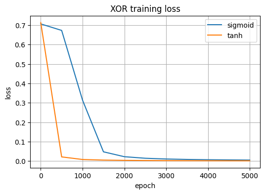

# 🚖 NYC Taxi Trip Duration Prediction


Predicting NYC taxi trip durations using neural networks — comparing three architectures of increasing depth and complexity, built from feature engineering to final evaluation.

---

## 🎯 What This Project Does

Given pickup/dropoff location, time, passenger count and other trip features, predict how long a taxi ride will take. Simple problem on the surface — but the data is messy, the feature engineering matters a lot, and the model architecture choices make a real difference.

---

## 📊 Dataset

**Source:** [NYC Taxi Trip Duration – Kaggle](https://www.kaggle.com/competitions/nyc-taxi-trip-duration)

- ~1.4 million taxi trips in New York City
- Features: pickup/dropoff coordinates, timestamps, passenger count, vendor ID
- Target: trip duration in seconds (log-transformed for training)

---

## 🔍 What I Built

### Neural Network from Scratch (XOR Proof of Concept)
Before training on the taxi data, I built and validated a neural network from scratch using NumPy on the XOR problem — testing sigmoid vs tanh activations to understand convergence behavior before scaling up.

### 3 Neural Network Architectures (Keras/TensorFlow)

| Model | Architecture | Learning Rate | Activation |
|-------|-------------|---------------|------------|
| Model_1 | 64 | 0.003 | tanh |
| Model_2 | 128 → 64 | 0.001 | relu |
| Model_3 | 256 → 128 → 64 | 0.0005 | relu |

All models trained with early stopping, StandardScaler normalization, and 80/10/10 train/val/test split.

---

## 📈 Results

### Model Performance Comparison

| Model | MSE | MAE | R² |
|-------|-----|-----|----|
| Model_1 (64, tanh) | 0.5070 | 0.5258 | 0.2059 |
| Model_2 (128→64, relu) | 0.3585 | 0.4264 | 0.4385 |
| **Model_3 (256→128→64, relu)** | **0.3581** | **0.4269** | **0.4392** |

> Model_3 wins — deeper architecture with smaller learning rate converged best. Model_2 and Model_3 are very close, suggesting diminishing returns beyond 2 layers for this dataset.

---

### XOR Training Loss — Sigmoid vs Tanh



> tanh converged ~3x faster than sigmoid on XOR — which informed the activation function choices for the taxi models.

---

### Model_3 — Train vs Validation Loss


> Clean convergence with no overfitting — train and val loss track closely throughout training.

---

### Validation Loss Comparison Across All Models


> Model_1 (tanh, single layer) plateaus early around 0.51 MSE. Model_2 and Model_3 both drop to ~0.36, confirming that deeper architectures with relu handle this regression task better.

---

## 💬 My Notes

The XOR experiment before jumping into the main model was actually really useful — it made me understand WHY tanh and sigmoid behave differently before I had to care about it on a larger dataset. Model_2 and Model_3 ended up almost identical in performance which was surprising — I expected the deeper model to win more clearly.

---

## 🛠️ Tech Stack

`Python` `TensorFlow` `Keras` `NumPy` `Pandas` `Scikit-learn` `Matplotlib` `Jupyter Notebook`

---

## 🚀 How to Run

```bash
git clone https://github.com/Diviya-tech/nyc-taxi-trip-duration-ml
cd nyc-taxi-trip-duration-ml
pip install -r requirements.txt
jupyter notebook
```

---

## 📁 Project Structure

```
nyc-taxi-trip-duration-ml/
├── results/
│   ├── xor_training_loss.png
│   ├── model_3_train_vs_loss_best.png
│   └── validation_across_all_models.png
├── notebooks/
├── README.md
└── requirements.txt
```

---

## 🔮 What's Next

- Try gradient boosting (XGBoost/LightGBM) — likely to outperform neural nets on tabular data
- Add distance feature using Haversine formula between pickup/dropoff coordinates
- Experiment with time-based features (rush hour, day of week)

---

## 📬 Connect

[](https://linkedin.com/in/sridivyadasari)
[](https://github.com/Diviya-tech)
